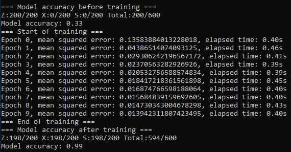

# multilayer-perceptron-numpy-array

My own implementation of a multilayer perceptron with NumPy arrays. This is a project developed in Python with the NumPy package.
This project represents an optimization based on my previous one: [A multilayer perceptron implementation with Python lists](https://github.com/EduardoKenji/multilayer-perceptron).

As of the previous project:
* There are 2400 images (800 per letter) in the training set and 600 images (200 per letter) in the validating set.
* The network units are 576 input units, 15 hidden layer neurons and 3 output units.
* The learning rate is 0.1 and the current number of training epochs is 10.

Comparison between the NumPy arrays implementation and the Python lists implementation:

* The NumPy arrays implementation has similar accuracy.
* However, the NumPy arrays implementation is hugely faster.

Python lists implementation:

NumPy arrays implementation:

The NumPy arrays implementation is almost 50 times faster than the Python lists implementation (0.4 seconds vs 18~19 seconds per epoch)
